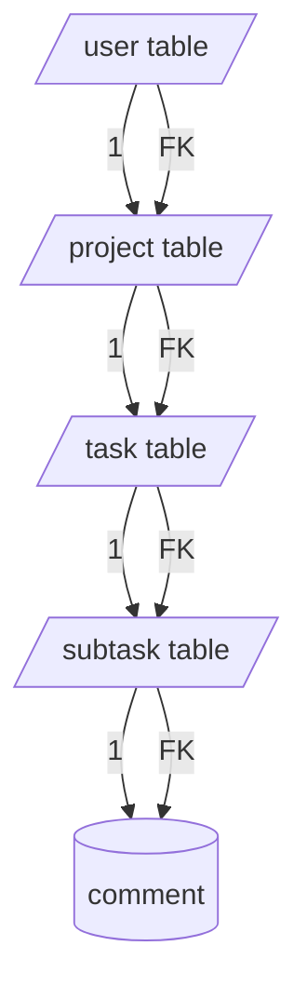

# Populating Recursive References on top of Drizzle-Seed

This is a fork of [Drizzle ORM](https://github.com/drizzle-team/drizzle-orm) and I wanted to add recursively nested references: for example 

The following table: 



Could be populated with dummy data like this:

```typescript

await seed(db, {
        users: schema.users,
        projects: schema.projectTable,
        tasks: schema.taskTable,
    }).refine(() => ({
        users: {
            count: 3,
            with: {
                projects: 2,
                 with: {
                    tasks: 2,
                },
            },
        }
    }));


```

## Running Tests

```typescript

./drizzle-orm/drizzle-seed/tests/sqlite/recursiveTables/recursiveTables.test.ts
```

is where the test file is.

## TODO

Need to clean up my work as it is a little messy
